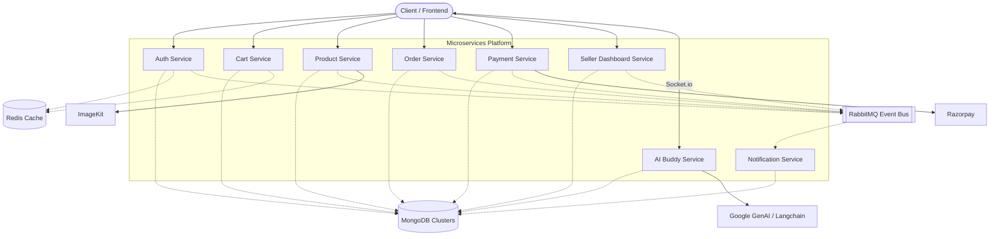

# Microservices E-commerce Platform Knowledge Transfer (KT)

Welcome to the KT documentation for the e-commerce microservices platform. This system is composed of 8 distinct microservices built using **Node.js, Express.js, MongoDB (Mongoose), RabbitMQ, and Redis**.

## 1. System Architecture & Diagram

The platform uses an event-driven architecture relying on **RabbitMQ** for asynchronous communication between services. **Redis** is used for caching and fast access (e.g., in `auth` and `cart`).

---

## 2. Microservices Overview

Below is an analysis of each microservice directory within the workspace:

### `auth`

- **Purpose**: Manages user registration, login, JWT token generation, and authentication.
- **Key Technologies**: Express, Mongoose, `bcryptjs` (password hashing), `jsonwebtoken` (JWT), `ioredis` (Redis), `amqplib` (RabbitMQ).
- **Testing**: Jest, `mongodb-memory-server`, `ioredis-mock`.

### `product`

- **Purpose**: Manages the product catalog, including adding, updating, and fetching products. Handles product image uploads.
- **Key Technologies**: Express, Mongoose, `imagekit` & `multer` & `sharp` (for image processing and upload), `amqplib` (event publishing).
- **Testing**: Jest with `@shelf/jest-mongodb`.

### `cart`

- **Purpose**: Manages the user's shopping cart. Requires fast read/write operations.
- **Key Technologies**: Express, Mongoose, `ioredis` (Redis caching).
- **Testing**: Jest, Supertest.

### `order`

- **Purpose**: Manages order creation, processing, and status updates. Interacts with other services like payment and cart.
- **Key Technologies**: Express, Mongoose, `axios`, `amqplib` (messaging for order status events).
- **Testing**: Jest, Supertest.

### `payment`

- **Purpose**: Integrates with third-party payment gateways to process transactions.
- **Key Technologies**: Express, Mongoose, `razorpay` (Payment Gateway SDK), `axios`, `amqplib`.
- **Testing**: Jest.

### `notification`

- **Purpose**: Handles all outgoing notifications (e.g., email) driven by events from the RabbitMQ bus (e.g., order successful, welcome email).
- **Key Technologies**: Express, Mongoose, `nodemailer` (for sending emails), `amqplib` (RabbitMQ consumer).

### `seller-dashboard`

- **Purpose**: A dedicated backend service for sellers to manage their store, view analytics, and track seller-specific data.
- **Key Technologies**: Express, Mongoose, `jsonwebtoken`, `amqplib`.

### `ai-buddy`

- **Purpose**: Provides AI-assisted features (like a chatbot or recommendation assistant) for users.
- **Key Technologies**: Express, Mongoose, `socket.io` (real-time communication), `@langchain/google-genai` & `@langchain/langgraph` (AI models & orchestration), `zod` (validation).

---

## 3. Tech Stack Summary

- **Backend Framework**: Node.js + Express.js
- **Database**: MongoDB (via Mongoose)
- **Caching / Session Management**: Redis (via `ioredis`)
- **Message Broker**: RabbitMQ (via `amqplib`)
- **Authentication**: JWT (JSON Web Tokens)
- **External Integrations**: Razorpay (Payments), ImageKit (Images), Google GenAI/Langchain (AI)
- **Testing**: Jest, Supertest, MongoDB Memory Server

## 4. How to Run Locally

Each service is an independent Node.js application. You will generally need to:

1. Ensure **MongoDB**, **Redis**, and **RabbitMQ** are running on your machine (or via Docker).
2. Go into each directory.
3. Configure the `.env` file for each service (ports, DB URIs, secret keys).
4. Run `npm install` to install dependencies.
5. Run `npm run dev` (starts the server with `nodemon` or `node --watch`).

.png>)

Directory structure:
└── 013harsh-super-nova/
├── ai-buddy/
│ ├── package.json
│ ├── Server.js
│ └── src/
│ ├── app.js
│ ├── agent/
│ │ ├── agent.js
│ │ └── tools.js
│ ├── db/
│ │ └── db.js
│ └── sockets/
│ └── socket.server.js
├── auth/
│ ├── jest.config.js
│ ├── package.json
│ ├── Server.js
│ └── src/
│ ├── app.js
│ ├── **tests**/
│ │ ├── addresses.test.js
│ │ ├── auth.test.js
│ │ └── setup/
│ │ ├── jest.setup.js
│ │ └── testDb.js
│ ├── broker/
│ │ └── broker.js
│ ├── controllers/
│ │ └── auth.controller.js
│ ├── db/
│ │ ├── db.js
│ │ └── redis.js
│ ├── middlewares/
│ │ ├── auth.middleware.js
│ │ └── Validate.middleware.js
│ ├── models/
│ │ └── user.model.js
│ └── routes/
│ └── auth.routes.js
├── cart/
│ ├── jest.config.js
│ ├── package.json
│ ├── server.js
│ ├── coverage/
│ │ ├── clover.xml
│ │ ├── coverage-final.json
│ │ ├── lcov.info
│ │ └── lcov-report/
│ │ ├── base.css
│ │ ├── block-navigation.js
│ │ ├── index.html
│ │ ├── prettify.css
│ │ ├── prettify.js
│ │ ├── sorter.js
│ │ └── src/
│ │ ├── app.js.html
│ │ ├── index.html
│ │ ├── controllers/
│ │ │ ├── cart.controllers.js.html
│ │ │ └── index.html
│ │ ├── middleware/
│ │ │ ├── auth.middleware.js.html
│ │ │ ├── index.html
│ │ │ └── validation.middleware.js.html
│ │ ├── models/
│ │ │ ├── index.html
│ │ │ └── model.js.html
│ │ └── router/
│ │ ├── cart.routes.js.html
│ │ └── index.html
│ └── src/
│ ├── app.js
│ ├── **tests**/
│ │ ├── cart.test.js
│ │ └── setup/
│ │ ├── jest.setup.js
│ │ └── testDb.js
│ ├── controllers/
│ │ └── cart.controllers.js
│ ├── db/
│ │ ├── db.js
│ │ └── redis.js
│ ├── middleware/
│ │ ├── auth.middleware.js
│ │ └── validation.middleware.js
│ ├── models/
│ │ └── model.js
│ └── router/
│ └── cart.routes.js
├── notification/
│ ├── package.json
│ ├── server.js
│ └── src/
│ ├── app.js
│ ├── email.js
│ └── borker/
│ ├── borker.js
│ └── linstners.js
├── order/
│ ├── package.json
│ ├── server.js
│ ├── src/
│ │ ├── app.js
│ │ ├── controller/
│ │ │ └── order.controller.js
│ │ ├── db/
│ │ │ └── db.js
│ │ ├── middleware/
│ │ │ ├── auth.middleware.js
│ │ │ └── order.validation.js
│ │ ├── models/
│ │ │ └── order.models.js
│ │ └── router/
│ │ └── order.routes.js
│ └── tests/
│ ├── mongodb.js
│ ├── order-endpoints.test.js
│ └── order.test.js
├── payment/
│ ├── package.json
│ ├── server.js
│ └── src/
│ ├── app.js
│ ├── broker/
│ │ └── broker.js
│ ├── controller/
│ │ └── payment.controller.js
│ ├── db/
│ │ └── db.js
│ ├── middleware/
│ │ ├── auth.middleware.js
│ │ └── validation.middleware.js
│ ├── models/
│ │ └── payment.model.js
│ └── router/
│ └── payment.route.js
└── product/
├── jest.config.js
├── package.json
├── server.js
├── .env.test
└── src/
├── app.js
├── **tests**/
│ ├── imageUpload.service.test.js
│ ├── product.advanced.test.js
│ ├── product.delete.test.js
│ ├── product.get.test.js
│ ├── product.patch.test.js
│ ├── product.seller.test.js
│ ├── product.test.js
│ └── setup/
│ ├── fixtures.js
│ ├── jest.setup.js
│ └── testDb.js
├── config/
│ └── imagekit.config.js
├── controllers/
│ └── product.controller.js
├── db/
│ └── db.js
├── middlewares/
│ ├── auth.middlerware.js
│ ├── upload.middleware.js
│ └── validation.middleware.js
├── models/
│ └── product.model.js
├── routes/
│ └── product.routs.js
└── services/
└── imageUpload.service.js
